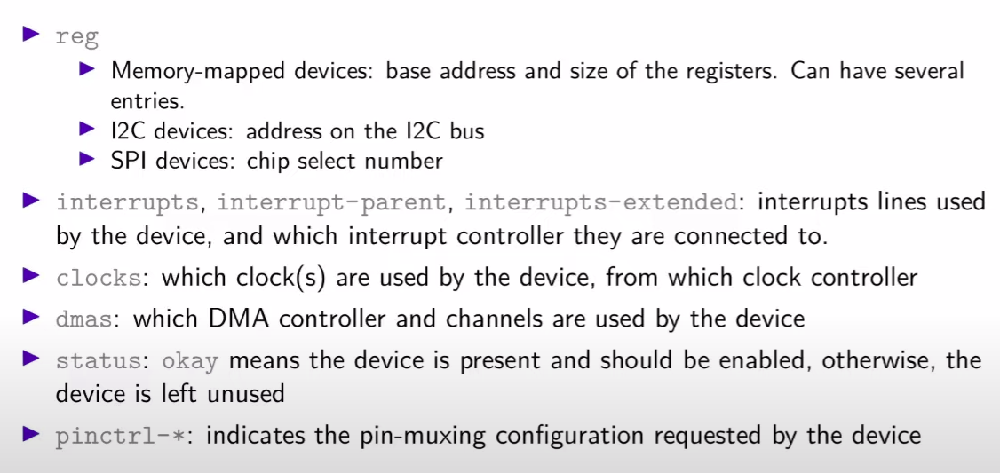
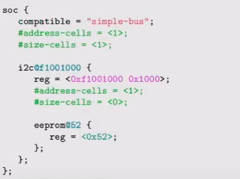
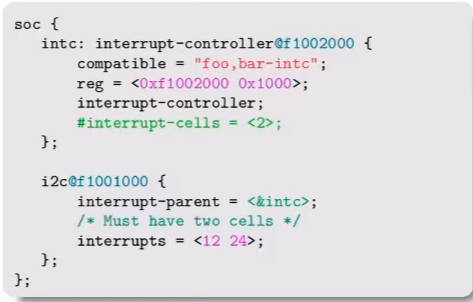
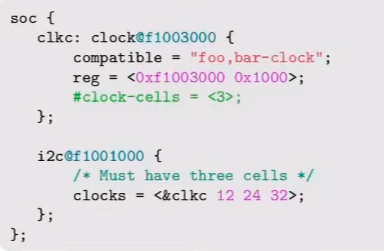

# Device Tree YAML Components

> Make sure to build and test your schemas before creating a patch. See [Testing yaml dtschemas](./testing-schema.md) for more details.

- compatible → `vendor,product`

- each **cell** is of **32-bit integers**

- `#address-cells` and`#size-cells` → number of cells used for address and size in the **subnode** 

- `#interrupt-cells` → number of cells used to encode interrupts specifiers for this interrupt controller

- `#clock-cells`, etc

