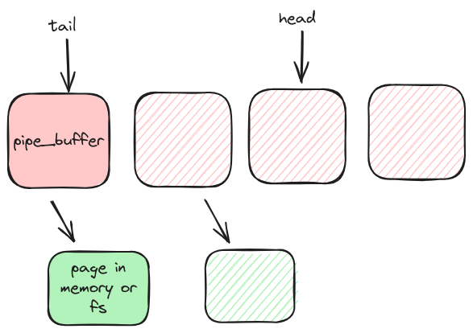
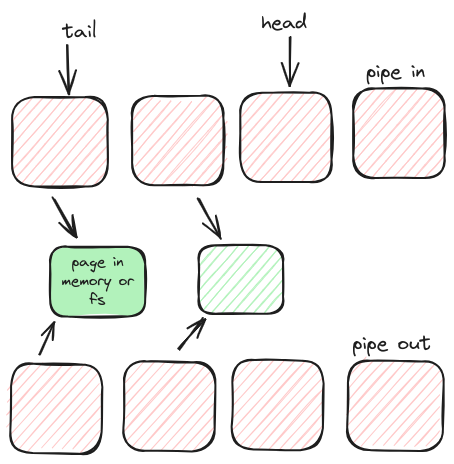

- [Pipes](#pipes)
  - [Pipe Buffer](#pipe-buffer)
  - [Pipe Structure](#pipe-structure)
  - [Splice](#splice)

# Pipes

- the **pipe** `syscall` is used to create a pair of fds. One fd reads from the pipe and another writes to the pipe.
- internally, pipe is a `ring buffer` where each element is represented by the `pipe_buffer` structure.

## Pipe Buffer

The pipe buffer data structure is implemented as :
```c
struct pipe_buffer {
	struct page *page;
	unsigned int offset, len;
	const struct pipe_buf_operations *ops;
	unsigned int flags;
	unsigned long private;
};
```

- page → points to the actual page containing the data
- offset, len → offset, len of the data in the page
- ops → `pipe_buf_operations` associated with this page. Possible ops are :
	- `confirm` -  handler that verifies that the data is there and the contents are good. If the page belongs to a file system (normally it’s in memory), then this call must wait for the I/O to complete. **Returns** :  0 for good, else negative error value.
	- `release` - this is called when the contents of the pipe has been completely consumed.
	- `try_steal` - attempts to take ownership of the pipe buffer and the contents. **Returns** : true for success.
	- `get` - get the reference to the pipe buffer

## Pipe Structure

```c
struct pipe_inode_info {
	struct mutex mutex;
	wait_queue_head_t rd_wait, wr_wait;
	unsigned int head;
	unsigned int tail;
	unsigned int max_usage;
	unsigned int ring_size;
	unsigned int nr_accounted;
	unsigned int readers;
	unsigned int writers;
	unsigned int files;
	unsigned int r_counter;
	unsigned int w_counter;
	bool poll_usage;
#ifdef CONFIG_WATCH_QUEUE
	bool note_loss;
#endif
	struct page *tmp_page;
	struct fasync_struct *fasync_readers;
	struct fasync_struct *fasync_writers;
	struct pipe_buffer *bufs;
	struct user_struct *user;
#ifdef CONFIG_WATCH_QUEUE
	struct watch_queue *watch_queue;
#endif
};
```

1. The pipe structure has `head` and `tail` pointers and a pointer to the list of `pipe_buffer`.
2. **write :** when data is written to the pipe, the buffer pointed to by the head is selected and a page is allocated for the data and the head is advanced until it reaches the tail pointer or fulfills the byte requirement. If the pipe is full and data is remaining to be written, the function waits for `wr_wait` event.
3. **read** : Reads the data from the page stored in the buffer pointed to by the tail pointer. If the pipe is empty, the read operation waits on the `pipe->rd_wait` event which is emitted once the writer writes to the pipe. The `buf->len` is reduced according to the data read.


## Splice

- it is a system call, moves data between two file descriptors without need for **copying between kernel address space and user address space**. 
- it works by transferring data between pipes since as we have already seen that the [[Pipes#Pipe Buffer|pipe buffer]] has direct access to the page.
- works in **3 modes** :
	- splice from **pipe to pipe**.
	- splice from **file to pipe**.
	- splice from **pipe to file**.
- instead of copying data, the other pipe end (read or write just references the page)
	- Example : if data from pipe_in has to be copied to pipe_out then, pipe_out will reference pages present in pipe_in.
