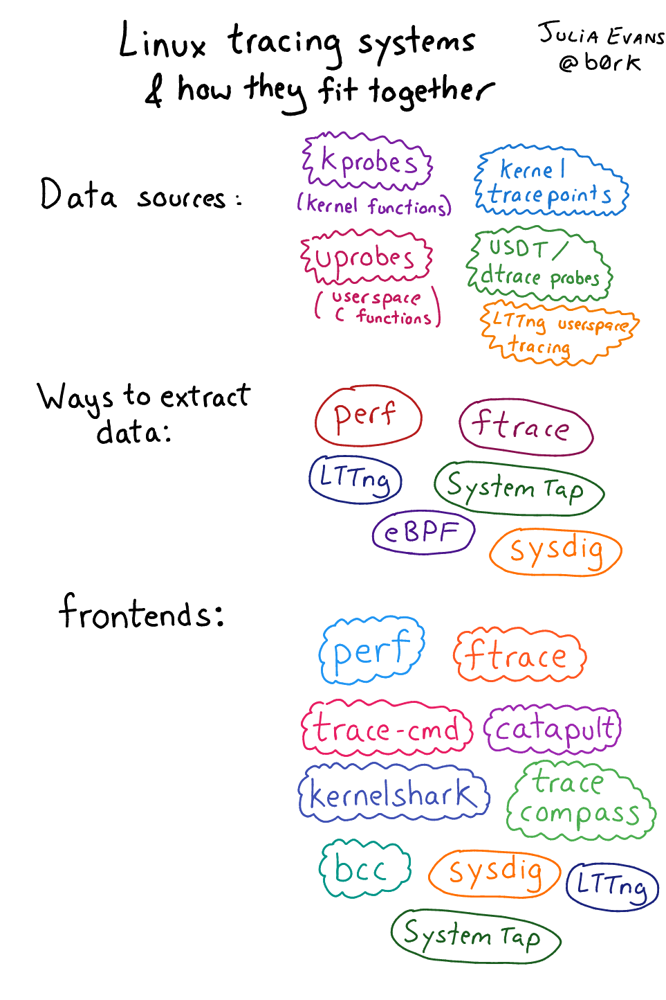
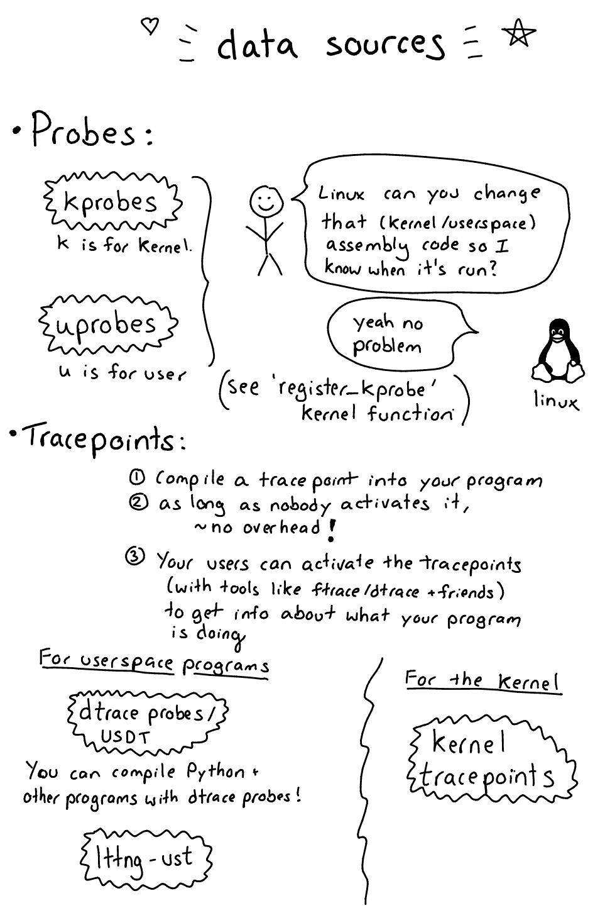
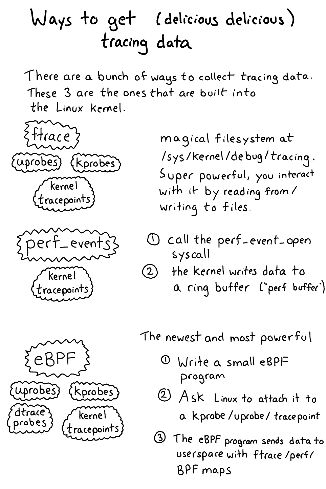
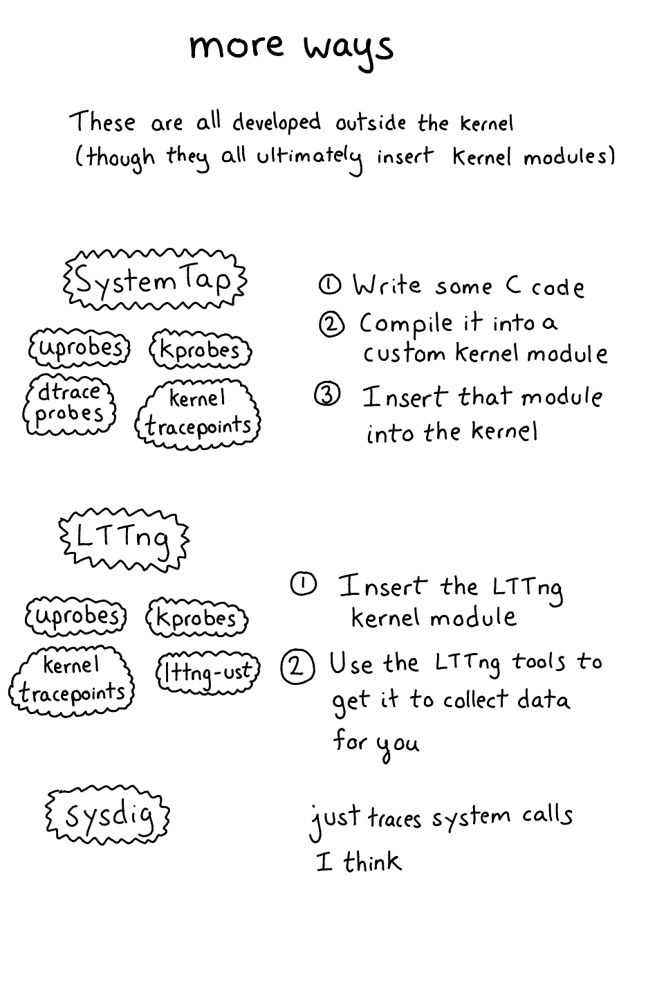
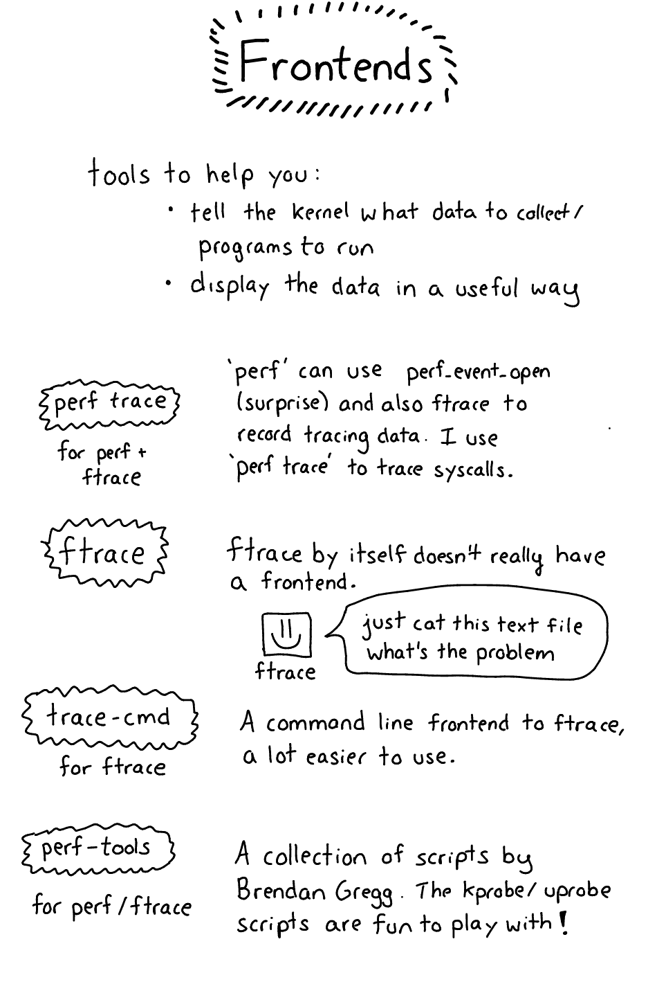
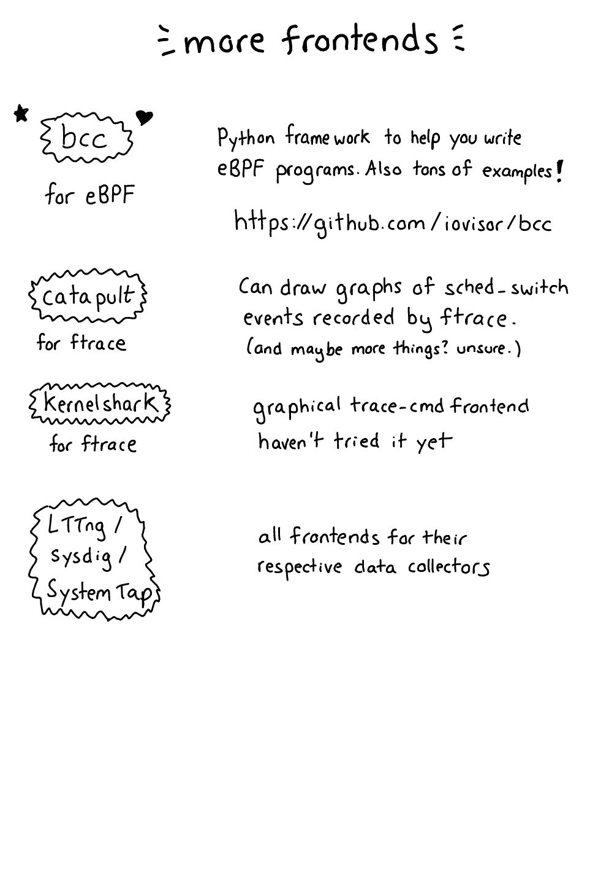

- [Tracing](#tracing)
  - [Userspace tools](#userspace-tools)
    - [strace and ltrace](#strace-and-ltrace)
  - [Kernelspace tools](#kernelspace-tools)
    - [Introdution](#introdution)
    - [Data Sources](#data-sources)
      - [tracepoints](#tracepoints)
      - [kprobes](#kprobes)
      - [uprobes](#uprobes)
    - [Data Extraction from sources](#data-extraction-from-sources)
      - [tracefs](#tracefs)
      - [ftrace](#ftrace)
      - [perf](#perf)
      - [eBPF](#ebpf)
      - [systemtap](#systemtap)
    - [References](#references)
- [References](#references-1)

# Tracing

## Userspace tools

### strace and ltrace

**strace :**

- Traces system calls, signals, andioctl() calls
- Can trace multiple processes simultaneously
- Can filter traces by process ID, system call, or signal
- Can output traces in a variety of formats, including text, JSON, and XML
- Can be used to attach to a running process or to trace a process from start to finish
- To use strace, simply run it with the name of the process you want to trace as an argument. For example, to trace the ls command, run the following command: `strace ls`

```shell
...
openat(AT_FDCWD, ".", O_RDONLY|O_NONBLOCK|O_CLOEXEC|O_DIRECTORY) = 3
fstat(3, {st_mode=S_IFDIR|0755, st_size=4096, ...}) = 0
getdents64(3, 0x5af2b17d56f0 /* 5 entries */, 32768) = 184
getdents64(3, 0x5af2b17d56f0 /* 0 entries */, 32768) = 0
close(3)                                = 0
fstat(1, {st_mode=S_IFCHR|0620, st_rdev=makedev(0x88, 0x3), ...}) = 0
write(1, " edited-2.jpg~\t ns3  'WhatsApp I"..., 69 edited-2.jpg~	 ns3  'WhatsApp Image 2023-07-08 at 6.39.50 PM.jpeg~'
) = 69
...
```

**ltrace**

- Traces library calls made by the program

## Kernelspace tools

### Introdution

Tracing can be divided into number of components :
1. Data sources
2. Ways to get the data to userspace
3. Frontends for these data sources in userspace

By frontend we mean the tool that you use to look at the data. For example, perf is a frontend for the kernel's performance counters, and ftrace is a frontend for the kernel's trace events (more on these later).


Credits: Julia Evans

### Data Sources

There are generally two categories of data sources in the kernel:
1. **probes :** This is when the kernel **dynamically modifies your assembly program** at **runtime** (like, it changes the instructions) in order to enable tracing. This is super powerful because you can **enable a probe on literally any instruction** in the program you’re tracing. [Kprobes](#kprobes) and [uprobes](#uprobes) are examples of this pattern.
   
2. **tracepoints :** This is something you **compile into your program**. When someone using your program wants to see when that tracepoint is hit and extract data, they can “enable” or “activate” the tracepoint to start using it. Generally a tracepoint in this sense doesn’t cause any extra overhead when it’s not activated, and is relatively **low overhead when it is activated**. USDT (“dtrace probes”), lttng-ust, and [kernel tracepoints](#tracepoints) are all examples of this pattern.


Credits: Julia Evans

#### tracepoints

- Tracepoints can be used without creating custom kernel modules to register probe functions using the event tracing infrastructure.
  
- To enable a particular event, simply echo it to /sys/kernel/tracing/set_event. 

Example : 
- Step 1 : we will enable an event syscalls:sys_enter_getpeername in our case, this will generate a trace every time getpeername() is executed. This function is used for making DNS queries : 
- Step 2 : we will listen on the trace_pipe in another terminal
- Step 3 : We will make a DNS query using dig program : dig www.httpbin.org
- Step 4 : We will disable tracing by echoing an empty string to the file

```shell
echo "syscalls:sys_enter_getpeername" > set_event
cat trace_pipe
 <...>-570949  [007] ..... 28732.695686: sys_getpeername(fd: f, usockaddr: c001784ae8, usockaddr_len: c001784ae4)
 <...>-570956  [001] ..... 28732.695731: sys_getpeername(fd: 1c, usockaddr: c000aacae8, usockaddr_len: c000aacae4)
 <...>-570957  [005] ..... 28732.695735: sys_getpeername(fd: 1b, usockaddr: c000ab0ae8, usockaddr_len: c000ab0ae4)
 <...>-570953  [002] ..... 28732.699574: sys_getpeername(fd: 1c, usockaddr: c000aacae8, usockaddr_len: c000aacae4)
 <...>-570947  [004] ..... 28732.700133: sys_getpeername(fd: f, usockaddr: c001784ae8, usockaddr_len: c001784ae4)
^C⏎
echo "" > set_event
```

**From the events directory**: events directory has a file named enable, if you echo 1 to the file, the event is enabled to be traced.

```shell
root@rog /s/k/tracing# cd events/syscalls/sys_enter_getpeername/
root@rog /s/k/t/e/s/sys_enter_getpeername# ls
enable  filter  format  hist  id  trigger
root@rog /s/k/t/e/s/sys_enter_getpeername# echo 1 > enable
```

#### kprobes

- kprobes let you dynamically change the **Linux kernel’s assembly code at runtime** (like, insert extra assembly instructions) to trace when a given instruction is called. 
- We of kprobes as tracing Linux kernel function calls, but you can actually **trace any instruction inside the kernel and inspect the registers**.
- [Brendan Gregg KProbe Script](https://github.com/brendangregg/perf-tools/blob/master/kernel/kprobe) to play around with kprobes
- Can be added and removed dynamically, on the fly. To enable this feature, build your kernel with `CONFIG_KPROBE_EVENTS=y`.
- Doesn’t need to be activated via current_tracer. Instead of that, add probe points via /sys/kernel/debug/tracing/kprobe_events, and enable it via `/sys/kernel/debug/tracing/events/kprobes/<EVENT>/enable`.

Useful in scenarios like :
1. You’re tracing a system call. System calls all have corresponding kernel functions like `do_sys_open` 
2. You’re debugging some performance issue in the network stack or to do with file I/O and you understand the kernel functions that are called well enough that it’s useful for you to trace them 
3. You’re a kernel developer,or you’re otherwise trying to debug a kernel bug, which happens sometimes!!

#### uprobes

- Uprobe based trace events are similar to kprobe based trace events. To enable this feature, build your kernel with `CONFIG_UPROBE_EVENTS=y`.

- Add probe points via /sys/kernel/debug/tracing/uprobe_events, and enable it via /`sys/kernel/debug/tracing/events/uprobes/<EVENT>/enable`

- However unlike kprobe-event tracer, the uprobe event interface expects the user to calculate the offset of the probepoint in the object.
  
### Data Extraction from sources

It’s important to understand the fundamental mechanisms by which tracing data gets out of the kernel. Theses are : ftrace, perf_events, eBPF, systemtap, and lttng.

**Ways to extract data :**


Credits: Julia Evans

**Tracing frontends :**



Credits: Julia Evans

#### tracefs

- tracefs is a pseudo file system that provides an interface to the kernel's trace events
- tracefs is mounted at /sys/kernel/tracing
- tracefs is used by ftrace, perf, and eBPF to access trace events
- tracefs can be mount using `mount -t tracefs nodev /sys/kernel/tracing `
**Note** : For backward compatibility, when mounting the debugfs file system, the tracefs file system will be automatically mounted at: `/sys/kernel/debug/tracing`

#### ftrace

- Ftrace is a tracing tool that is built into the Linux kernel. It is used to trace the kernel function calls and events.

Some files available under /sys/kernel/tracing : 

1. `available_events` : lists out events available for tracing in the kernel

```shell
...
sof_intel:sof_intel_hda_irq
sof_intel:sof_intel_ipc_firmware_response
sof_intel:sof_intel_ipc_firmware_initiated
sof_intel:sof_intel_D0I3C_updated
sof_intel:sof_intel_hda_irq_ipc_check
sof_intel:sof_intel_hda_dsp_pcm
sof_intel:sof_intel_hda_dsp_stream_status
sof_intel:sof_intel_hda_dsp_check_stream_irq
sof:sof_widget_setup
Sof:sof_widget_free
...
```

2. `current_trace` : display the current tracer that is configured, if no tracers are enabled it gives **nop**. To enable tracing you can just **echo a tracer to this file**. To stop, you can **echo nop to the same file.** 
  
```shell
echo function > /sys/kernel/tracing/current_tracer
cat /sys/kernel/tracing/trace
    ...
       budgie-wm-1094    [004] d..2. 27575.413078: irq_enter_rcu <-sysvec_irq_work
       budgie-wm-1094    [004] d.h2. 27575.413078: irqtime_account_irq <-sysvec_irq_work
       budgie-wm-1094    [004] d.h2. 27575.413079: __sysvec_irq_work <-sysvec_irq_work
       budgie-wm-1094    [004] d.h2. 27575.413079: signal_irq_work <-irq_work_single
       budgie-wm-1094    [004] d.h2. 27575.413079: ktime_get <-signal_irq_work
       budgie-wm-1094    [004] d.h2. 27575.413079: __rcu_read_lock <-signal_irq_work
       budgie-wm-1094    [004] d.h2. 27575.413080: __rcu_read_unlock <-signal_irq_work
       budgie-wm-1094    [004] d.h2. 27575.413080: _raw_spin_lock <-signal_irq_work
       budgie-wm-1094    [004] d.h3. 27575.413080: irq_enable <-signal_irq_work
       budgie-wm-1094    [004] d.h3. 27575.413080: intel_engine_irq_enable <-signal_irq_work
       budgie-wm-1094    [004] d.h3. 27575.413080: _raw_spin_lock <-intel_engine_irq_enable
       budgie-wm-1094    [004] d.h4. 27575.413081: gen8_logical_ring_enable_irq <-intel_engine_irq_enable
...
echo nop > /sys/kernel/tracing/current_tracer 
```

3. `trace`: holds the output of the trace in a human readable format (described below).
**Note**: tracing is temporarily disabled while this file is being read

4. `trace_pipe`: the output is the same as the “trace” file but this file is meant to be streamed with live tracing.
    
- Reads from this file will block until new data is retrieved.
- Unlike the “trace” file, this file is a consumer. This means reading from this file causes sequential reads to display more current data. 
- Once data is read from this file, it is consumed, and will not be read again with a sequential read. 

5. `available tracers`: holds the different types of tracers that have been compiled into the kernel. The tracers listed here can be configured by echoing their name into current_tracer
  
```shell
cat /sys/kernel/tracing/available_tracers 
timerlat osnoise hwlat blk mmiotrace function_graph wakeup_dl wakeup_rt wakeup function nop
```

#### perf

- Profiler tool for Linux, part of the Linux kernel tools.
- Identifying CPU-bound bottlenecks, cache misses, and branch mispredictions.
- Profiling both userspace and kernelspace code to understand overall system performance.
- Uses hardware counters and software events to collect data. It's directly integrated with the CPU's performance monitoring capabilities, allowing it to gather detailed metrics about hardware and application performance.

Working : 
- You call the perf_event_open system call
- The kernel writes events to a ring buffer in user memory, which you can read from

#### eBPF

eBPF is a large topic and is covered in-depth in the [eBPF section](./ebpf-tracing.md)

#### systemtap

- You decide you want to trace a kprobe
- You write a “systemtap program” & compile it into a kernel module
- That kernel module, when inserted, creates kprobes that call code from your kernel module when triggered (it calls `register_kprobe`)
- You kernel modules prints output to userspace (using relayfs or something)

TODO: Study the document and complete this section [https://sourceware.org/systemtap/archpaper.pdf](https://sourceware.org/systemtap/archpaper.pdf) and [https://www.brendangregg.com/blog/2015-07-08/choosing-a-linux-tracer.html](https://www.brendangregg.com/blog/2015-07-08/choosing-a-linux-tracer.html)

**SystemTap supports**: tracepoints, kprobes, uprobes, USDT

### References

- [An introduction to KProbes - LWN](https://lwn.net/Articles/132196/)
- [Brendan Gregg KProbe Script](https://github.com/brendangregg/perf-tools/blob/master/kernel/kprobe)
- [Linux uprobe - Brendan Gregg](https://www.brendangregg.com/blog/2015-06-28/linux-ftrace-uprobe.html)
- [Using the TRACE_EVENT() macro (Part 1) - LWN](https://lwn.net/Articles/379903/)
- [Linux tracing systems & how they fit together - Julia Evans](https://jvns.ca/blog/2017/07/05/linux-tracing-systems/)

# References

- [Event Tracing - Kernel Doc](https://www.kernel.org/doc/html/latest/trace/events.html)
- [Tracing the Linux kernel with ftrace](https://sergioprado.blog/tracing-the-linux-kernel-with-ftrace/)
- [Mentorship Session: Tools and Techniques to Debug an Embedded Linux System](https://www.youtube.com/watch?v=Paf-1I7ZUTo)